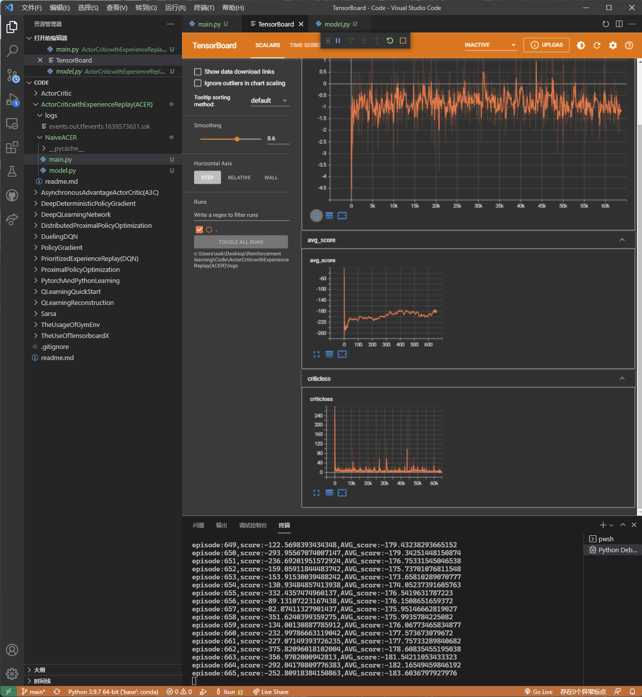

# ACER

`Actor-Critic的off-policy算法`

# 它不是有效的，它不能够学到东西，为什么不能够使用 ER 呢？

- policy gradient 估计的是经验的梯度，如果使用旧的 policy 产生的样本，那么我们就不在估计当前 policy 的梯度了，所以 policy gradient 不能使用 experience，就相当于你使用几十年前的房价来对比现在的房价一样，更新策略之后，之前的行为就不再是我这个策略做出来的了，所以我们不能够使用 experience

- Qlearning 学习的是 Q 值，它与上下状态是没有关系的，但是 AC 是学习一个策略值，这个值需要下一个状态的采样，也就是说它与下 n 个状态是相关的，而 Qlearning 只是需要一个最大化的操作

- 我们需要使用 importance sampling 来使 policy gradient 或者 acer 变成 off policy，将存储每个版本的策略的参数，并且赋予数据集一个权重 p_new/p_old 将过去的数据“强行调整”为服从当前策略分布的数据

- off-policy：使值最大（即获得最多的 reward） on-policy：根据 π_theta 来选择当前的动作

- 可以看到效果不好

- ACER 为了利用历史数据使用了多项技术，整体算法较为复杂，[论文在这](https://arxiv.org/pdf/1611.01224.pdf)，主要使用了
  - (1)Retrace Q estimation
  - (2)偏差校正截断重要性权重
  - (3)更加高效的 Trust region policy optimization

# 未完成……

ACERwithIS

## 找了个 ACER 的代码

还没有搞懂这个是什么玩意，所以抄了个代码
[链接](https://github.com/dchetelat/acer/)
