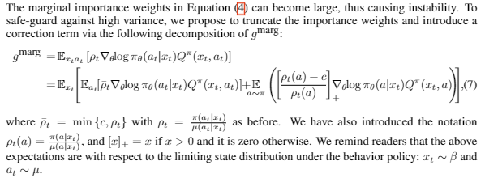
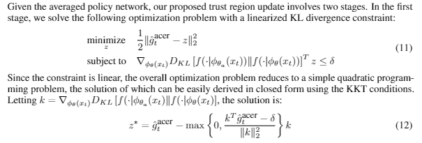
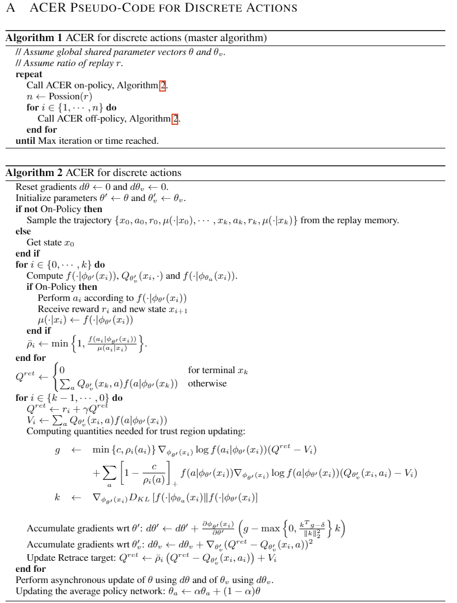

# ACER

`Actor-Critic的off-policy算法`
其中 Naive ACER 是单纯使用了 Replay Buffer，而论文中的 ACER 使用了多种手段。

# Naive ACER 不是有效的，它不能够学到东西，为什么不能够使用 ER 呢？

- policy gradient 估计的是经验的梯度，如果使用旧的 policy 产生的样本，那么我们就不在估计当前 policy 的梯度了，所以 policy gradient 不能使用 experience，就相当于你使用几十年前的房价来对比现在的房价一样，更新策略之后，之前的行为就不再是我这个策略做出来的了，所以我们不能够使用 experience

- Qlearning 学习的是 Q 值，它与上下状态是没有关系的，但是 AC 是学习一个策略值，这个值需要下一个状态的采样，也就是说它与下 n 个状态是相关的，而 Qlearning 只是需要一个最大化的操作

- 我们需要使用 importance sampling 来使 policy gradient 或者 ac 变成 off policy，将存储每个版本的策略的参数，并且赋予数据集一个权重 p_new/p_old 将过去的数据“强行调整”为服从当前策略分布的数据

- off-policy：使值最大（即获得最多的 reward） on-policy：根据 π_theta 来选择当前的动作

- 可以看到效果不好

- ACER 为了利用历史数据使用了多项技术，整体算法较为复杂，[论文在这](https://arxiv.org/pdf/1611.01224.pdf)，主要使用了
  - (1)Retrace Q estimation
  - (2)偏差校正截断重要性权重
  - (3)更加高效的 Trust region policy optimization

## 拿来主义- github 上关于 ACER 的代码

还没有搞懂这个是什么玩意，所以抄了个代码跟着他打了一遍，然后稍微重构了一下，写了注释，仅对于 discrete 状况使用，源代码在[acer-github 文件夹](./acer-github),重构的代码在[acer-refactor 文件夹里面](./acer-refactor)

[源代码链接](https://github.com/dchetelat/acer/)

## ACER 关于 AC 的改进

- Agent 与环境交互成本过高，需要一个算法能够减少与环境的交互，这个特性称为 sample efficiency，提高这个的方法之一就是 ER- Experience Replay，但是 Actor Critic 不能够直接使用 ER，那么我们需要开发出一种离线的 AC 算法，这也就是我们 ACER 的由来。

- 首先，对于 offpolicy 的策略来说，拿到的 trajectory 并不一样，需要用 Importance ratio 来进行权重调整。需要对整个轨迹进行一个 importance ratio 的连乘。

- 这个连乘很容易过大或者是为 0，所以要进行改进

- 由于 p_t= pi(at|xt)/mu(at|xt)，这个数值容易过大或者为 0,使得算法很不稳定，因此使用了一个叫做偏差校正截断重要性权重(importance weight truncation with bias correction)的技术，作如下变换 

- 对于状态-动作价值函数的估计，使用了 Retrace 的技术

- 需要确定每一步更新的步长，希望步长产生的变化在策略空间不要太大，使用 KL 散度来进行限制。避免像 TRPO 对 KL 关于 theta 求 Hessian，在这里使用了 average policy network， 其参数的更新方式是 theta_a = alpha \* theta_a + (1-alpha)theta 

# 相比于 PPO

1. ACER 算法复杂的多，但是在 Atari 游戏基准上比 PPO 好一点点
2. TRPO，对于连续的控制任务有用，但是不容易与在策略和值函数或者辅助损失函数间共享参数的算法兼容。
3. PPO 在简单性、调参难度等方面优于 1 2 算法

# 具体流程

# 原论文

[ACER](./1611.01224.pdf)
