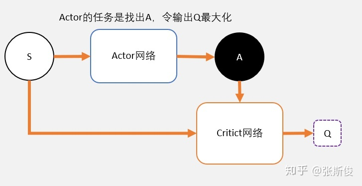

# DDPG(Deep Deterministic Policy Gradient)

---

- `他在连续的动作空间上面有较好的表现，就是为了解决Qlearning中maxQ的问题`
- DDPG 是一种 ActorCritic 结构，但是他不是 ActorCritic，因为他们的更新方式不同
- AC 和 PG 采用的是带权重的梯度更新，策略网络的损失是-log_probability\*Q_pi(S,A),Q_pi(S,A)评价这个策略好不好，好的话我们要多一些这种动作，不好的话，就少一点。
- 而我们 DDPG 中的策略网络的损失是-Qvalue，这是 Qlearning 中的东西，我们的 Actor 需要使 Qvalue 最大就行了
- 它继承了 DQN 的 fixed Q target 和 Policy Gradient 的思想
- 对于离散空间，无法计算 Q 的梯度，所以要用 Gumbel-Softmax Trick 来使用采样的方式输出离散动作

---

其中 Critic 和 Actor 都有两个网络，它们是 DQN 的思想，参数异步更新。 

---

- DQN 不能够用于连续控制问题，因为 max Q(s',a')只能处理离散型的问题
- DQN 解决了 Q 表不能解决的问题：连续型状态，但是没有解决连续型动作的问题，也就是说 Q(state)输出的 Q 值是一个离散型的值。
- 为了解决 Q 表的问题，我们使用一张连续的布来覆盖 Qtable，这就是 Critic 的功能
- 我们需要一个网络之类的东西，能够直接完成 Q(state)->action 的映射，而且这个动作能够让 Q 最大，这就是我们的 Actor 的功能。

---

## Principal

 
 
`采用带权重的梯度更新`

## Conclusion

- 需要四个网络，Critic 和 Actor 各两个
- 采用带权重的梯度更新策略
- 是个 off-policy 算法，也是可以用离线的经验
- 算法更新跟 DQN 一样
- `DQN+Actor-Critic =>Deep Deterministic Policy Gradient (DDPG)。实际上DDPG其实更接近DQN，只是采用了类似Actor-Critic的结构。DDPG吸收了Actor-Critic中策略梯度单步更新的优点，同时还吸收了DQN对Q值估计的技巧。DDPG 最大的优势就是能够在连续动作上更有效地学习。`

## Features

- Exploration noise
- Actor-Critic Achetecture
- Fixed Q-Target
- Policy Gradient
- Experience Replay (OFF-POLICY)

## Problems

在训练到后面的时候，loss 不降反升？什么原因？待查,TD_error 能到上十亿去，离谱

`在model.py里面第33行，将数据映射到[-2,2]的时候写错了，导致此问题`

## 现在好了

