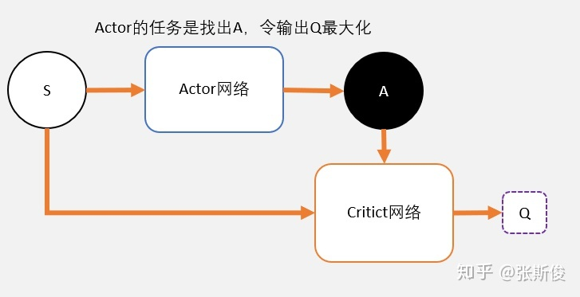

# DDPG(Deep Deterministic Policy Gradient)

---

- `他在连续的动作空间上面有较好的表现`
- DDPG 是一种 ActorCritic 结构
- 它继承了 DQN 的 fixed Q target 和 Policy Gradient 的思想

---

其中 Critic 和 Actor 都有两个网络，它们是 DQN 的思想，参数异步更新。 

---
* DQN不能够用于连续控制问题，因为max Q(s',a')只能处理离散型的问题
* DQN解决了Q表不能解决的问题：连续型状态，但是没有解决连续型动作的问题，也就是说Q(state)输出的Q值是一个离散型的值。
* 为了解决Q表的问题，我们使用一张连续的布来覆盖Qtable，这就是Critic的功能
* 我们需要一个网络之类的东西，能够直接完成Q(state)->action的映射，而且这个动作能够让Q最大，这就是我们的Actor的功能。

---
## Principal
 
 
`采用带权重的梯度更新`

## Conclusion
* 需要四个网络，Critic和Actor各两个
* 采用带权重的梯度更新策略
* 是个off-policy算法，也是可以用离线的经验
* 算法更新跟DQN一样
* `DQN+Actor-Critic =>Deep Deterministic Policy Gradient (DDPG)。实际上DDPG其实更接近DQN，只是采用了类似Actor-Critic的结构。DDPG吸收了Actor-Critic中策略梯度单步更新的优点，同时还吸收了DQN对Q值估计的技巧。DDPG 最大的优势就是能够在连续动作上更有效地学习。`