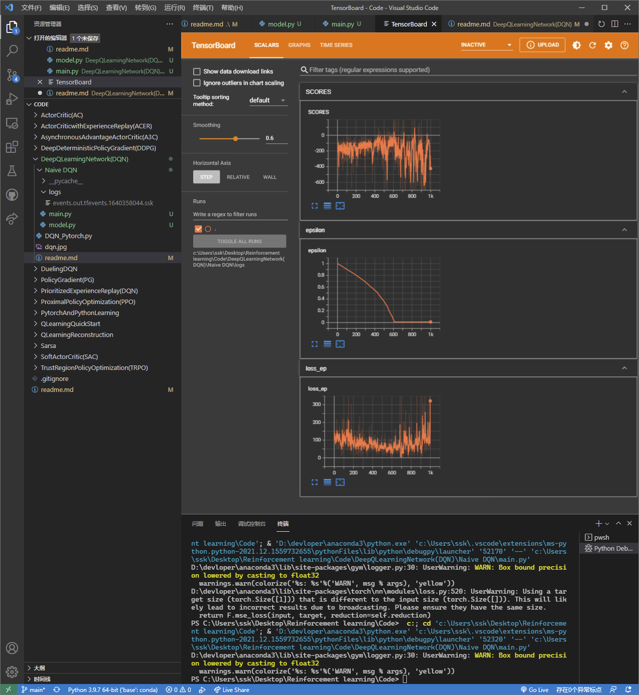

# Deep Q Learning Network

- QLearning 的局限性：Q 表无法进行所有情况的枚举，在某些情况下是不可行的，比如下围棋。

- 使用神经网络进行该操作就可以解决该问题。

```
f(state,action)->action.value
或者是
f(state)->list<actionvalue>
```

# Features: Expericence Replay and Fixed Q-targets

- Experience Replay : 将每一次实验得到的经验片段记录下来，然后作为经验，投入到经验池中，每次训练的时候随机取出一个 BATCH，可以复用数据。

- Fixed Q-target: 在神经网络中，Q 的值并不是互相独立的，所以不能够进行分别更新操作，那么我们需要将网络参数复制一份，解决该问题。

- 为了解决 overestimate 的问题，引入 double DQN，算法上有一点点的改进

```

Deep Q Network
融合 Qlearning 和神经网络

1、传统方法劣势
状态过多的时候无法完全枚举（围棋）

2、神经网络如何处理该问题？
Q 值=网络（tuple（状态，动作））
动作=网络（状态）
两种方法都省去了 Q 表的构建操作

3、输入输出
网络输入->状态
输出->每个动作的权重 ，根据最大的权重选择下一步的动作

4、更新策略
q_eval = self.eval_net(b_s).gather(1, b_a)

q*next = self.target_net(b_s*).detach()

q_target = b_r + GAMMA \* q_next.max(1)[0].view(BATCH_SIZE, 1)

loss = self.loss_func(q_eval, q_target)

MSE（估计值，实际值），再进行反向传播

```

# 为什么没有 ER 和固定 Q 网络性能不行？

在 Naive DQN 文件夹中，实现了一个没有 ER 和 Fixed Q-targets 的 DQN，但是它的性能是不行的(在连续的空间上）。



- 可以图上面看到 LOSS 在震荡
- 造成这个问题的原因：
  1. 序列决策样本的关联性。输入的状态都是连续发生的，前后状态具有关联性，而对于基于最大似然法的机器学习模型来说，我们有一个很重要的假设：训练样本是独立且来自相同分布的，ER 解决了数据的相关性和非平稳分布的问题
  2. 我们希望学习得到的值函数能够表示在当前状态行动下的长期收益的期望，然而每一次交互得到的序列，只能代表当前状态一行动下的一次采样轨迹，并不能代表所有可能的轨迹。这样估计的结果就和期望的结果存在一定的差距。随着交互时间不断拉长，这个差距的累积会越来越大。如果完全使用序列的估计值进行训练， 某一轮训练时模型会朝着一个序列的估计训练，另一轮训练又会朝着另一个序列的估计训练，那么模型很容易产生较大波动。
  3. 监督学习中，我们要用预测值来去逼近真实值，真实值是固定不变的，在 DQN 中，我们有 Qtarget=reward+gamma\*maxQ（s',a',theta），后者 maxQ 也是网络输出的，所以这个值会变化的，所以需要 fixQtarget。
