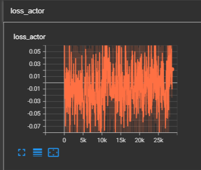
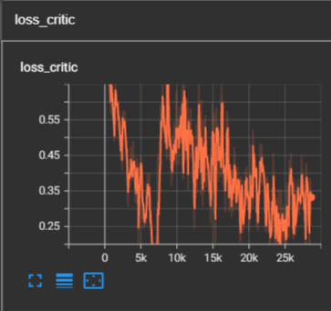
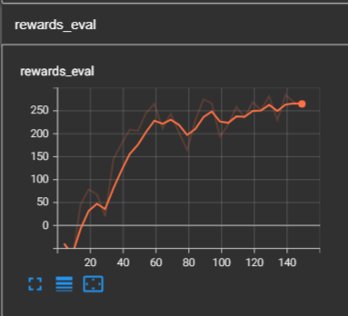

# DPPO

- the multi-thread version of Proximal Policy Optimization

- the code of PPO can be seen [there](<../ProximalPolicyOptimization(PPO)>)

- the code in the folder DPPO - Github was taken from [there](https://github.com/ZYunfeii/DRL_algorithm_library)

- [paper](./1506.02438.pdf)

