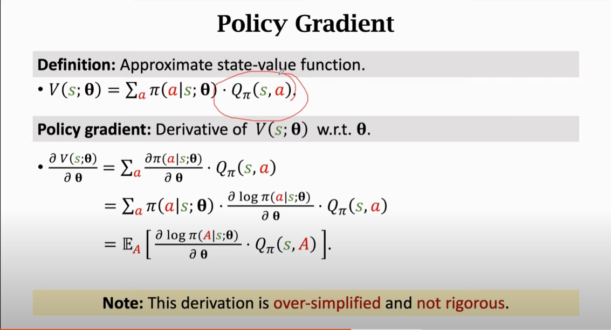

# policy greadient

在连续区间可用，克服 Qlearning 的缺点，没有 Qlearning 的误差，但是它确实进行了反向传递，反向传递的结果就是让这个动作`更有可能发生`，即增加可能性

---

- 不同于 Qlearning，它直接输出的是动作而不是动作对应的 value，但是他也要接受环境信息 observation

- Policy π 是一个网络，他的参数是 θ，输入是环境的 state，输出动作的几率分布(distribution of probability)

- s1->agent->a1->env->s2->agent->a2->env->s3-...->end 这是一个 Trajectory

- reward：（s1，a1），（s2，a2），…… 能够得到多少 reward？我们要调整 θ 使 reward 最大

- 对于 reward 我们不能够计算它的准确值，能够计算期望值，我们计算的方法是：穷举所有的策略。

- 算出 gradient reward，然后进行梯度增加

- PGTorch/main.py 67 行的那个操作可以不需要，这是为了提醒网络，多走前面几步，不要走使杆子立不起来的那几步，所以在前面多更新，后面少更新。个人觉得这是因为杆子立起来他的 reward 总是 1，所以要干预一下

- 为了防止没有采样到的行为（并不一定是差的）发生概率降低，我们可以把 reward 减去 baseline

- 在一个过程中，并不是每个动作都是对这个过程有益的，但是它们都乘上了一个 reward，都被视为重要的，在理想情况下，我们每个动作都采样到了，不会出现这个问题。但是在现实情况下需要采取一些动作来计算这些动作对于总体的 contribution，这个 contribution 跟环境有关。

- 还有一种方法就是计算前 n 步的动作对于于该一步 reward 的贡献。

---

## 它应该是这种形式

---

```python
class PolicyGradient(nn.Module):
    def __init__(self) -> None:
        super().__init__()

    def _build_net(self):
        pass

    def choose_action(self, observation):
        pass

    def store_transition(self, s, a, r):
        pass

    def learn(self, s, a, r, _s):
        pass

    def _discount_and_norm_rewards(self):
        pass

```

tensorflow 版本在 tf=2.7 的时候无法运行,提示没有 placeholder 这个函数，垃圾玩意

---

pytorch 写出来了一个，但是梯度下降不下去，不知道为什么，遂放弃。main.py 是照搬网上的一个代码

---

`花了一天时间，看出来了，有一个步骤使用了 detach，导致梯度消失了`

## 关于 Log probability



## 更新网络参数

1. 获得 state St
2. 根据策略 pi 选取动作 At
3. 计算 Q_pi(St,At)，计算这个动作的价值,我们没有办法计算 Q_pi，我们使用一下两种方法近似：
   - Rainforce：玩一轮游戏，使用 discountedrewards，需要观测到所有的奖励
   - 为什么不用神经网络进行 Q_pi 的计算呢？
4. 求导，算出 log_pi 关于 theta 的导数
5. 4 的导数乘以 Q_pi(St,At)，得到策略梯度，是个近似
6. 更新梯度 theta_t+1 = theta_t + beta \* gradient
