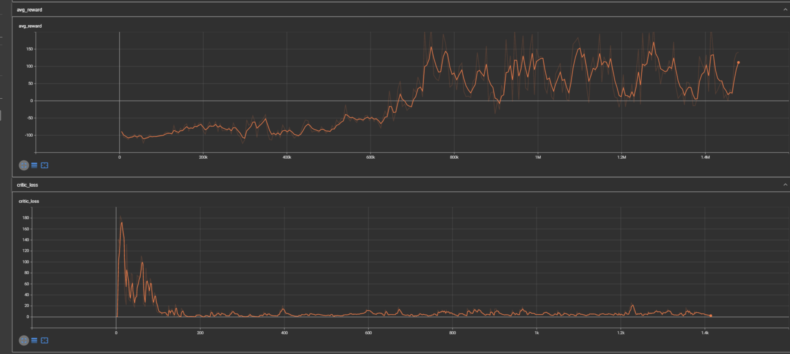
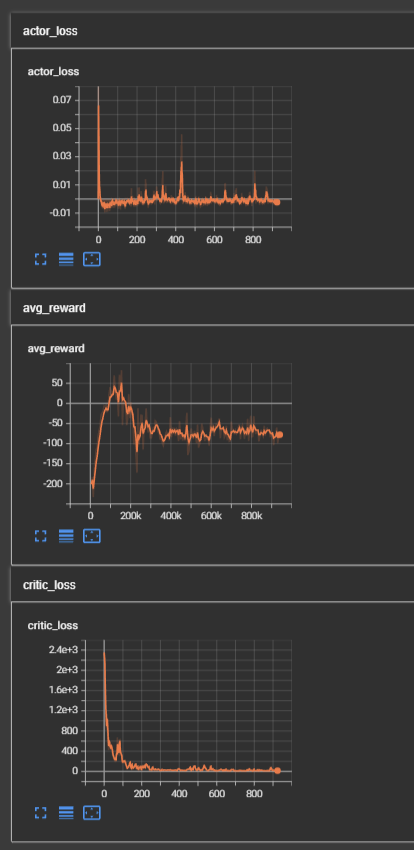
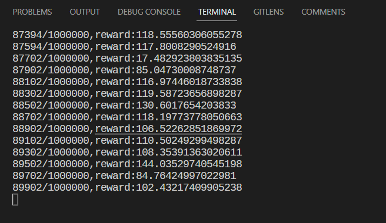
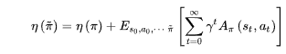

# PPO onpolicy 算法 - OPENAI BASELINE

写了两个版本，一个是discrete一个是continuous,虽然PPO十分优秀，但是PPO有一个致命缺点，就是容易陷入LocalMinimum，可以在PPOGitHub上尝试LunarLander-v2，在PPOMedium上尝试LunarLanderContinuous-v2，两者都会陷入局部最优，得不到满的奖励（大概250）。

- 一个版本是从[Medium上面抄下来的](https://medium.com/analytics-vidhya/coding-ppo-from-scratch-with-pytorch-part-1-4-613dfc1b14c8),在[PPOMedium](./PPOMedium/)这个文件夹下面
- 另外一个版本是从[GITHUB](https://github.com/tomasspangelo/proximal-policy-optimization)上面抄的，增加了熵，然后我自己重构了一下代码，让它更易读,在[PPOGitHub](./PPOGitHub/)这个文件夹下面

实验结果

- BipedalWalker-v3

- LunarLanderContinuous-v2

- LunarLander-v2

- 主要为了解决 actor critic 训练步长的问题，在这里实现了 ppo-clip
- On-policy 是要用 $π_θ$ 收集数据，当 $θ$ 更新了，我们就要重新进行数据收集。
- 这个方法十分慢，我们能不能使用 $\pi_{\theta^\prime}$收集数据，把这个数据给 $π_θ$ 使用进行训练，由于 $\theta^\prime$是不变的，那我们就可以进行数据重用。
- gradient for update： advantage\* gradient probablity ,advantage 表示的是从这一步能够获得多大的益处

## importance Sampling

- 这个理论支持了我们从 ON-policy 转向 OFF-policy
- 问题：当采样不够的时候，这个方法效果就很差了
- 在应用阶段使用 θ 进行数据采样，然后积累经验，进行参数的更新

## PPO / TRPO

TRPO 将 $θ$ 和 $θ^\prime $的分布写在了约束里面
PPO 写在了 loss 损失里面 $βKL(θ，θ_k)$

## ON-policy 和 OFF-policy

on：与环境交互的这个 agent 就是我们要学习的 agent，off：不一定是这个 agent。

## 在代码中，将会实现 PPO-Clip 算法，这是 OpenAI 提出的

效果很差，因为“偶尔的胜利”不足以使网络的参数完全修正，但是 offpolicy 的 dqn with per 能够多次学习成功的经验，所以对于那个把小车推上坡的那个游戏来说，8 太行

对于月球车来说也是不行的，他会走向local minimum（飞天上不下来）

## TrustRegionPolicyOptimization

- TRPO 算法 (Trust Region Policy Optimization)和 PPO 算法 (Proximal Policy Optimization)都属于 MM(Minorize-Maximizatio)算法
- MM 算法是一种迭代优化方法，它利用函数的凸性来找到它们的最大值或最小值。
- policy gradient 的缺点：步长（lr）不好控制，而当步长不对的时候，PG 学习到的策略会更差，导致越学越差最后崩溃。
- 当策略更新后，回报函数的值不能更差，我们要找到新的策略使回报函数不减小，这就是 TRPO 解决的问题
- 要想不减，自然想到一个方法：theta=theta+一个正值
- 
- 目标：最大化优势函数，并且使新旧策略的差异不能够太大
- <https://blog.csdn.net/tanjia6999/article/details/99716133>
- PPO 性能更 TRPO 差不多，但是更加的简单。

## PPO Offpolicy 思路

假设有两个策略 PI 和 PIold

在 s 状态下，他们对于一个离散的动作，输出的概率分别是 [0.5, 0.5], [0.9, 0.1]，假设 PI 的一次采样是 5 个 a1，5 个 a2，PIold 采样是 9 个 a1，1 个 a2

critic 网络输出的 td error 为[1, 2]

显然，我们如果要更新 PI 的话，我们的方向是提高动作 2 的概率，但是最后下来，我们如果使用 PIold 的数据来更新 PI，a1 的概率被提高了 9 次，最后 a1 的概率应该是比 a2 高的，所以不能够使用 Replay Buffer

解决方法就是： **importance sampling**
