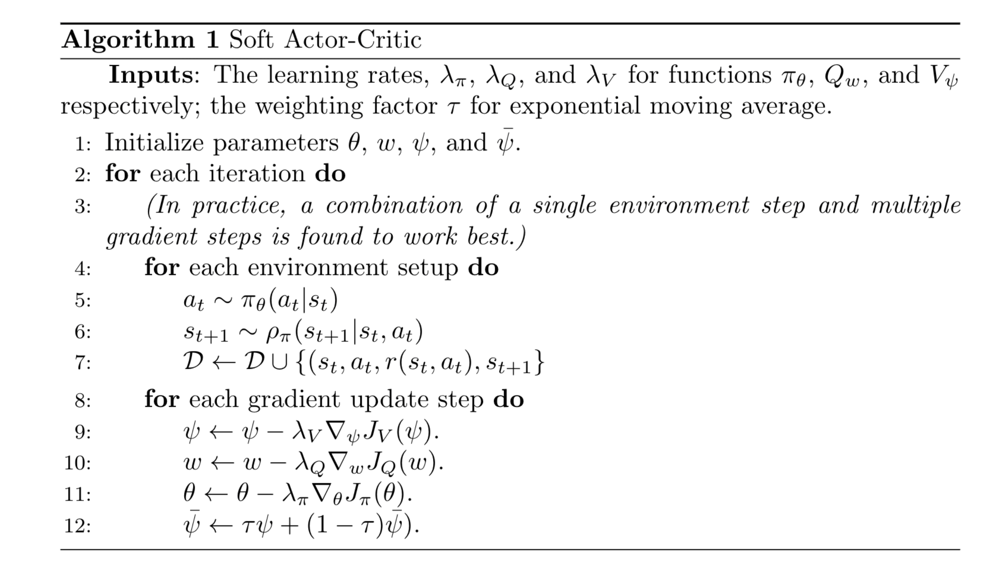

# Soft Actor Critic - off policy with maximum entropy

敲一遍没搞懂啊？

于是照着教程敲了两个版本的:

- 一个是首页 Readme 里面 Machine Learning with Phil 的代码
- 一个是[BY571 的版本](https://github.com/BY571/Soft-Actor-Critic-and-Extensions)

---

重构了个版本，在 SoftActorCritic 里头，但是不知道为什么 actor loss 降不下来，有可能是我太心急了，训练轮数不够。

焯，又写了个 BUG，导致 memory 没有新内容进来，真的垃圾玩意！见 models.py 257 行，之前写了个 done=False ，之后是 True 了，就没变过。

---

**_Off-Policy Maximum Entropy Deep Reinforcement Learning with a Stochastic Actor_**

- 集大成者
- 面向 Maximum Entropy Reinforcement Learning 开发的一种 off-policy 算法，使用随机策略
- 对比 DDPG，它不遗漏每一个好的动作
- 对比 AC，它能够使用经验池,更加的"sample effecient"
- 解决 PPO，TRPO 的低效
- 解决 DDPG，TD3 的不稳定性
- 所以使用了随机策略+经验池+最大化熵

# Model Free 算法

1. TRPO、PPO
2. DDPG、D4PG、TD3
3. Soft Q-Learning、Soft Actor-Critic

# 基于最大熵的 RL 算法

1. 可以学到所有的最优路径
2. 更强的探索能力，不放掉任意一个有用的动作和轨迹
3. 更强的鲁棒性（面对干扰的时候能够自我调整）
4. 对比 DDPG，它是随机的，而 DDPG 是确定的

# 三个关键技术

1. 采用分离策略网络以及值函数网络的 AC 架构
2. ER 能够使用历史数据，高效采样
3. 熵最大化以鼓励探索

# SAC 要学习的东西

1. Policy PI_theta
2. Soft Q value function Q_omega
3. Soft State-value function V_psi（现在不用了）

 

因此 SAC 需要维持三个网络：状态价值网络、软 Q 值网络、策略网络，为了使训练更加稳定，我们还需要一个状态价值目标网络（target net）；此外，一个 Q 值网络就是可以的，但是两个更加好，训练的时候取两者中较小的，一共是 *5*个网络，但是现在一般不用状态价值网络了，故减成 3 个

# 发展历程

1. policy gradient 计算策略的梯度
2. actor critic 使用 nn 来近似 Value 函数
3. advantage actor critic 使用 advantage 来更新 critic
4. TRPO 使用 KL 散度来约束 actor critic 的步长，稳定！
5. PPO 比 TRPO 在算法上更好！

# 为什么能够收敛

1. 将熵加入到 J（theta）里面会不会影响到训练？->文中证明不会，它会收敛到一个软 Qvalue
2. Actor 更新（Soft Policy Improvement），限制参数更新步长。 Update the policy towards the exponential of the new Q-function
