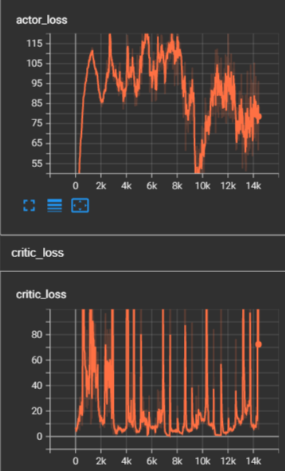
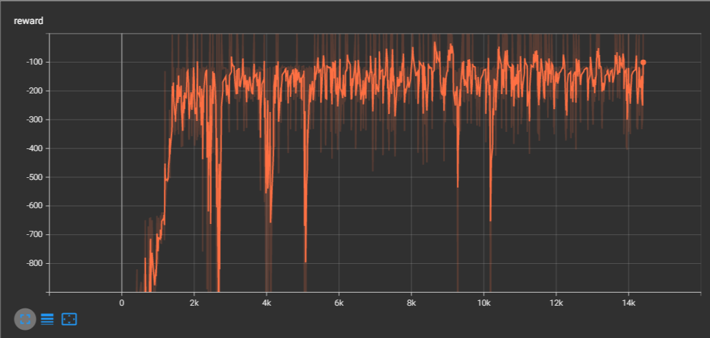
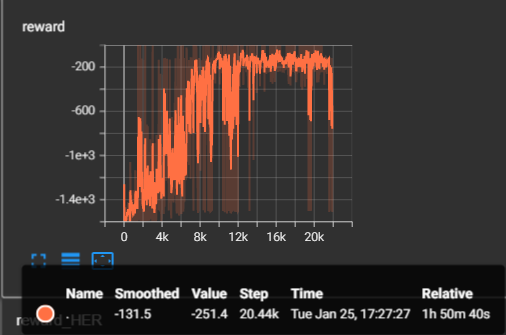
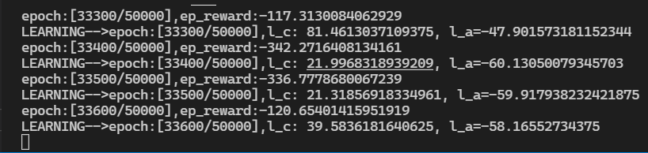

# TwinDelayedDeepDeterministicPolicyGradient(TD3)

DDPG 的改进方法

- Twin：采用类似于 DoubleDQN 的方式解决了 DDPG 中 Critic 对动作的过估计（over estimate）问题
- Delayed：延迟 Actor 更新，更加稳定
- 在 Actor 目标网络输出动作 A’加上噪声，增加算法稳定性。

- 
- 

# 参数

1. 激进的 tau（如 0.1，0.5 等）会扰乱训练过程，而过小的 tau（0.005）会使网络收敛很慢，选择一个正确的 tau 对于网络收敛很有用

2. 同 1，学习率也会极大影响速度。

3. batch_size 对训练的影响尚不清楚

4. 要选择合适的 policy_noise、noise_clip，否则会影响到网络对于价值函数的判断，从而导致损失降下去了，但是训练效果不好

# HER 多大程度上会拖慢学习速度？

for Pendulum-v1

with HER

NO HER

因为这两个是同时开始训练的，但是它们的进度不同，说明 HER 还是拖累了训练速度，无 HER 比有 HER**快了 17%**
