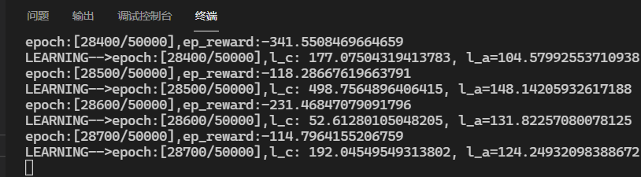

# TwinDelayedDeepDeterministicPolicyGradient(TD3)

TD3 的算法没啥问题，但是我写的代码似乎效果很差，不知道是哪个部分出了问题。

问题解决，在 OPENAI spinning up 中，TD3 采用一次与环境交互多次梯度下降（代码中是 50 次），而我只有一次，所以速度降低了很多，按照道理来说我的代码应该也能达到类似效果，但是可能要很长时间，我没有耐心等待罢了

---

TD3:DDPG 的改进方法

- Twin：采用类似于 DoubleDQN 的方式解决了 DDPG 中 Critic 对动作的过估计（over estimate）问题
- Delayed：延迟 Actor 更新，更加稳定
- 在 Actor 目标网络输出动作 A’加上噪声，增加算法稳定性。

- 
- 

# 参数

1. 激进的 tau（如 0.1，0.5 等）会扰乱训练过程，而过小的 tau（0.005）会使网络收敛很慢，选择一个正确的 tau 对于网络收敛很有用

2. 同 1，学习率也会极大影响速度。

3. batch_size 对训练的影响尚不清楚

4. 要选择合适的 policy_noise、noise_clip，否则会影响到网络对于价值函数的判断，从而导致损失降下去了，但是训练效果不好

# PER 多大程度上会拖慢学习速度？

for Pendulum-v1

with PER

NO PER

因为这两个是同时开始训练的，但是它们的进度不同，说明 PER 还是拖累了训练速度，无 PER 比有 PER**快了 17%**

# HER

搞得不是很清楚
**只适用于 pendulum 环境**

_因为它的 goal 计算和 reward 计算是因环境而异的，没有统一的解决方案_

1. 解决的问题：在稀疏奖励的环境中训练 agent
2. 假设条件：知道要学习的目标 goal，知道如何优化奖励函数 reward function
3. 主要想法：将 goal 加入 transition tuples(s,a,r,s',goal)利用 goal 之间的相似性，使得完成不同 goal 的 transition tuples 可以辅助其它的 goal 做训练

局限：

1. 目标 goal 有时候不清楚
2. 不知道如何优化奖励函数 reward function
3. s 不能被修改的情况

思想：

1. 事后诸葛,应用于稀疏奖励和二分奖励，不需要复杂的奖励函数工程设计。

2. 强化学习中的一个最棘手的问题就是稀疏奖励：经验池子中很少包含有奖励的经验

3. 于是我们有 HER，可以从稀疏、二分奖励的问题中高效采样并进行学习，而且可以运用于**_所有 OFF policy 算法中_**

4. 二分奖励

   - 简单来说，就是完成目标是一个值，没有完成就是另外一个值
   - if reach the goal : r = 0 else: r=-1

5. 稀疏奖励
   简言之，完成目标的 episode 太少或者完成目标的步数太长，导致负奖励的样本数过多

6. 在机器人领域，要想使强化学习训练它完美执行某任务，往往需要设计合理的奖励函数，但是设计这样的奖励函数工程师不仅需要懂得强化学习的领域知识，也需要懂得机器人、运动学等领域的知识。而且，有这些知识也未必能设计出很好的奖励函数供智能体进行学习。因此，如果可以从简单的奖励函数（如二分奖励）学习到可完成任务的模型，那就不需要费心设计复杂的奖励函数了。

7. 就是运用了这个思想对经验池进行了扩充，将稀疏奖励问题给转化成非稀疏奖励，大大的扩展了经验池中完成任务的经验数量

## HER 效果

for Pendulum

