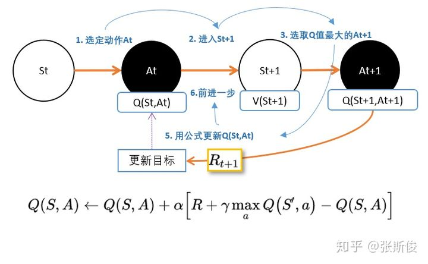
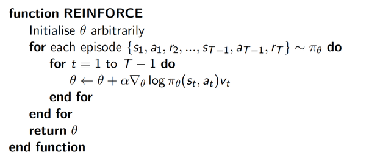

# 强化学习

## 进度

|   method    | done |
| :---------: | ---- |
| Qlearnling  | √    |
|    Sarsa    | √    |
| SarsaLambda | √    |
|     DQN     | √    |
| DuelingDQN  | √    |
| DQNwithPER  | √    |
|     PG      | √    |
| ActorCritic | √    |
|     A3C     | √    |
|     A2C     | ×    |
|     SAC     | ×    |
|    ACER     | ×    |
|    DDPG     | √    |
|     TD3     | ×    |
|     PPO     | √    |
|    DPPO     | ×    |
|    TRPO     | ×    |
| DQNwithHER  | ×    |
| DDPGwithHER | ×    |
|    DIAYN    | ×    |

---

## Key Concepts

代理(agent)在一个环境(environment)中执行动作/行为(action)。环境如何对代理的动作做出响应由一个已知或未知的模型(model)来定义。执行代理可以停留在环境中的某个状态(state) $s\in \mathcal{S}$，可以通过执行某个行为/动作(action) $a\in \mathcal{A}$来从一个状态$s$进入到另一个状态$s'$。代理会到达什么状态由状态转移概率$(P)$决定。代理执行了一个动作之后，环境会给出一定的奖励(reward) $r\in\mathcal{R}$作为反馈。

- 几乎所有的强化学习问题可以使用马尔科夫决策过程（MDPs）来描述，MDP 中的所有状态都具有“马尔科夫性”：未来仅仅依赖于当前的状态，并不与历史状态相关，在给定当前状态下，未来与过去条件独立，也就是当前状态包含了决定未来所需的所有信息。

- 策略：即智能体 agent 的行为函数 PI，是当前状态到一个动作的映射，它可以是随机性的也可以是确定性的：

  - PI(s)=a
  - PI(a|s)=P_pi[A=a|S=s]

- 价值函数：价值函数是衡量一个状态或者是一个`(状态，行为)元组`的好坏；未来的奖励（称为`回报`）定义为带衰减的后续奖励之和(discounted rewards)

  - $$ G*t = R*{t+1} + \gamma R*{t+2} + \dots = \sum*{k=0}^{\infty} \gamma^k R\_{t+k+1} $$
  - gamma 作为对未来奖励的`惩罚`(`penaty`)，因为：

    - 未来奖励的不确定性
    - 未来奖励不会直接提供收益
    - 数学上便利，无需在乎太远的奖励，被 gamma 衰减掉了
    - 使用衰减系数，无需担心存在无限循环的转移图

  - 存在两种形式：状态 s 的状态价值——`回报的期望值`；某个（state，action）元组的行为价值函数——`该行为能够获得多大收益`？
    - 我们可以利用行为的分布以及行为的价值函数来推导`状态价值函数`
      $$ V*{\pi}(s) = \sum*{a \in \mathcal{A}} Q\_{\pi}(s, a) \pi(a \vert s) $$
    - 定义行为价值函数和状态价值函数之间的差称为`优势(advantage)`函数，意味着这个动作比`平均状态`好多少？
      $$ A*{\pi}(s, a) = Q*{\pi}(s, a) - V\_{\pi}(s) $$

- 贝斯曼方程
  - 贝尔曼方程指的是一系列的等式，它将价值函数分解为直接奖励加上衰减后的未来奖励。

## Qlearning - off_policy TD control

更新一个 Q 表，表中的每个元素代表每个状态下每个动作的潜在奖励<br>
根据 Q 表选择动作，然后更新 Q 表

```
state 1 2 3 4 5
left  0 0 0 0 0
right 0 0 0 1 0
```

更新策略：`现实值=现实值+lr*（估计值-现实值）`

---

## Sarsa - on_policy TD control

Qlearning 更新方法：`根据当前Q表选择动作->执行动作->更新Q表`<br>
Sarsa 更新方法：`执行动作->根据当前估计值选择下一步动作->更新Q表`

**Sarsa 是行动派，Qlearning 是保守派**

---

## SarsaLambda

Sarsa 的升级版<br>
Qlearning 和 Sarsa 都认为上一步对于成功是有关系的，但是上上一步就没有关系了，SarsaLambda 的思想是：`到达成功的每一步都是有关系的，他们的关系程度为：越靠近成功的步骤是越重要的`<br>

```
step
1-2-3-4-5-success
重要性1<2<3<4<5
```

---

## DQN

<br>
用神经网络代替 Q 表的功能

Q 表无法进行所有情况的枚举，在某些情况下是不可行的，比如下围棋。<br>
Features: `Expericence Replay and Fixed Q-targets`

Experience Replay : `将每一次实验得到的惊艳片段记录下来，然后作为经验，投入到经验池中，每次训练的时候随机取出一个 BATCH，可以复用数据。`

Fixed Q-target: `在神经网络中，Q 的值并不是互相独立的，所以不能够进行分别更新操作，那么我们需要将网络参数复制一份，解决该问题。`

为了解决 overestimate 的问题，引入 double DQN，算法上有一点点的改进，复制一份网络参数，两个网络的参数异步更新

---

## Policy Gradient

核心思想：让好的行为多被选择，坏的行为少被选择。<br>
采用一个参数 vt，让好的行为权重更大<br>
<br>

---

## ActorCritic

使用神经网络来生成 vt，瞎子背着瘸子

---

## Dueling DQN

将 Q 值的计算分成状态值 state_value 和每个动作的值 advantage，可以获得更好的性能

---

## DQN with Prioritized Experience Replay

在 DQN 中，我们有 Experience Replay，但是这是经验是随机抽取的，我们需要让好的、成功的记忆多多被学习到，所以我们在抽取经验的时候，就需要把这些记忆优先给网络学习，于是就有了`Prioritized`Experience Replay

---

## DDPG


- Exploration noise
- Actor-Critic Achetecture
- Fixed Q-Target
- Policy Gradient
- Experience Replay (OFF-POLICY)

---

## A3C

- A3C 里面有多个 agent 对网络进行异步更新，相关性较低
- 不需要积累经验，占用内存少
- on-policy 训练
- 多线程异步,速度快

---

## PPO

- 感觉像 Actor-Critic 和 DQN 的折中，先取一部分经验，然后进行网络参数的更新
- Actor-Critic 是每走一步进行参数更新
- DQN 是直接积累经验然后从经验池子中学习
- PPO 是积累部分经验(一个 trajectory)，然后进行多轮的梯度下降

## Soft Actor Critic & DQN with Hindsight Experience Relpay && Diversity Is All You Need & DDPG with Hindsight Experience Relpay && TD3 && A2C

待完成

---

## Requirements

- numpy
- tensorboardX
- torch
- gym

---

## 杂谈&经验

- t.tensor.detach()： 返回 t.tensor 的数据而且 require_grad=False.torch.detach()和 torch.data 的区别是，在求导时，torch.detach()会检查张量的数据是否发生变化，而 torch.data 则不会去检查。
- with t.no_grad(): 在应用阶段，不需要使用梯度，那么可以使用这个去掉梯度
- 如果在更新的时候不调用 optimizer.zero_grad，两次更新的梯度会叠加。
- 使用 require_grad=False 可以冻结神经网络某一部分的参数，更新的时候就不能减 grad 了
- tensor.item()，直接返回一个数据，但是只能适用于 tensor 里头只有一个元素的情况，否则要是用 tolist()或者 numpy()
- 不建议使用 inplace 操作
- hard replacement 每隔一定的步数才更新全部参数，也就是将估计网络的参数全部替换至目标网络而 soft replacement 每一步就更新，但是只更新一部分(数值上的一部分)参数。
- pytorch 官网上有:https://pytorch.org/tutorials/intermediate/reinforcement_q_learning.html
- nn.Module.eval()递归调用子模块，将 Module.train 改成 false
- 类似于 tensor.pow, tensor.sum, tensor.mean, tensor.gather 这些操作都可以使用 torch.pow(tensor,\*args)等来代替，使用 t.pow 这种类型的函数可以直接知道它的参数（dim=？之类的），用 tensor.pow 的话可能会因为识别不出来这是个 tensor，导致这个方法出不来。（比如说 a=t.ones((1,1,1)),b=a+a，调用 b.sum 的时候按 TAB 就出不来)
- 同上一条，在传参的时候尽量把参数的类型写清楚，不然在下面使用的时候按 tab 也出不来，十分难顶。例如

  ```
  def forward(self, x:t.Tensor)->t.Tensor:
  return self.net(x).squeeze(1)
  ```

- 关于 nn.Module.eval()

  - net.eval()并不是一种局部禁用梯度计算的机制

  - 从功能上来说，eval 和 t.no_grad 和 inference 模式是一样的， eval 会影响到模型的训练当且仅当某些模块出现在你的网络中，如 BatchNorm 何 Dropout2d 之类的

  - 如果你的网络中出现了 nn.Dropout 或者 nn.Batchnorm2d 这种模块，需要调用 model.eval()和 model.train()，因为它们在两种模式中的表现不一样。

  - 不管怎样还是推荐使用 model.train()和 model.eval()，因为你正在使用的模型可能在 eval 和 train 两种模式下表现不同，而你自己不知道。

- TD 学习 temporal difference,与蒙特卡洛方法类似，时差(TD)学习是一个无模型方法，它从每轮的经验数据中学习。不同的是，TD 学习可以从不完整的一轮数据中学习，因此我们无需让代理一直执行到环境为终止态。
- `PG算法大家族`
  - DQN、Qlearning、Sarsa 等都在学习状态或者行为价值函数，然后再根据价值函数来选择未来的行为，而策略梯度直接学习策略本身
  - 策略梯度方法主要特点在于直接对策略进行建模，通常建模为由 theta 参数化的函数 PI_theta（a|s），回报函数的值收到该策略的直接影响，于是我们可以用多种方法来最大化回报函数
  - Actor-Critic：学习策略和价值函数
  - Asynchronous Advantage Actor Critic：侧重于并行训练
  - Advantage Actor Critic：引入协调器，收敛更快，性能比 A3C 更好
  - Deterministic Policy Gradient：将环境建模为一个确定性的决策：a=mu(s)
  - Deep Deterministic Policy Gradient:结合了 DPG 和 DQN 的 AC 架构，DDPG 算法在学习一个确定性策略的同时通过演员-评论家框架将其扩展到连续的动作空间中
  - Trust Region Policy Optimization：为了提升训练的稳定性，我们应该避免更新一步就使得策略发生剧烈变化的参数更新。置信区间策略优化通过在每次迭代时对策略更新的幅度强制施加 KL 散度约束来实现上述理念。
  - Proximal Policy Optimization：实现了 TRPO 的性能，通过使用一个截断的替代目标来简化算法
  - Actor Critic with Experience Replay:离线的 A3C 算法，使用了一系列操作来克服离线算法的不稳定性
  - Soft Actor Critic：将策略的熵度量纳入回报函数中用以鼓励探索：我们希望学习到一种尽可能随机行动的策略，同时仍然能够在任务中完成目标。它是一个遵循最大熵强化学习框架的离线演员-评论家模型。一个先例工作是软 Q 学习。
  - Twin Delayed Deep Deterministic:在 DDPG 算法的基础上应用了很多新的改进从而防止值函数的过估计现象
  - CONCLUSION
    - 尽量减少方差并保持偏差来稳定训练过程
    - 使用离线方法来保持高探索度
    - 使用经验回放来提高效率
    - 可以学习确定性的策略（deterministic）
    - 避免对值函数的过度估计（over estimation）

## 引用

[莫烦 python](https://mofanpy.com/)

[《动手学深度学习》](https://zh-v2.d2l.ai/)

[pytorch 教程](https://www.youtube.com/watch?v=exaWOE8jvy8&list=PLqnslRFeH2UrcDBWF5mfPGpqQDSta6VK4)

[OpenAI Gym](https://gym.openai.com/)

[17 种深度强化学习算法用 Pytorch 实现](https://blog.csdn.net/tMb8Z9Vdm66wH68VX1/article/details/100975138?spm=1001.2101.3001.6650.14&utm_medium=distribute.pc_relevant.none-task-blog-2%7Edefault%7EBlogCommendFromBaidu%7Edefault-14.no_search_link&depth_1-utm_source=distribute.pc_relevant.none-task-blog-2%7Edefault%7EBlogCommendFromBaidu%7Edefault-14.no_search_link)

[hhy_csdn 博客-关于强化学习](https://blog.csdn.net/hhy_csdn)

[PG 算法](https://tomaxent.com/2019/04/14/%E7%AD%96%E7%95%A5%E6%A2%AF%E5%BA%A6%E6%96%B9%E6%B3%95/)

[什么是强化学习](https://paperexplained.cn/articles/article/detail/33/)

[Markov Chain Monte Carlo Without all the Bullshit](https://jeremykun.com/2015/04/06/markov-chain-monte-carlo-without-all-the-bullshit/)

[马尔科夫决策与平稳分布](https://blog.csdn.net/qq_34652535/article/details/85343518)

```

```
