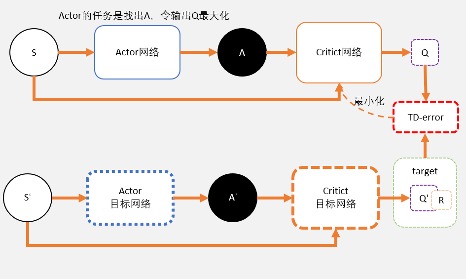

# 强化学习

## 进度

|   method    | done |
| :---------: | ---- |
| Qlearnling  | √    |
|    Sarsa    | √    |
| SarsaLambda | √    |
|     DQN     | √    |
| DuelingDQN  | √    |
| DQNwithPER  | √    |
|     PG      | √    |
| ActorCritic | √    |
|     A3C     | √    |
|     A2C     | √    |
|     SAC     | ×    |
|    ACER     | √    |
|    DDPG     | √    |
|     TD3     | ×    |
|     PPO     | √    |
|    DPPO     | ×    |
|    TRPO     | √    |
| DQNwithHER  | ×    |
| DDPGwithHER | ×    |
|    DIAYN    | ×    |

---

<br><br><br>

## 1. 关键概念 Key Concepts

1. **代理(agent)在一个环境(environment)中执行动作/行为(action)。环境如何对代理的动作做出响应由一个已知或未知的模型(model)来定义。执行代理可以停留在环境中的某个状态(state) $s\in \mathcal{S}$，可以通过执行某个行为/动作(action) $a\in \mathcal{A}$来从一个状态$s$进入到另一个状态$s'$。代理会到达什么状态由状态转移概率$(P)$决定。代理执行了一个动作之后，环境会给出一定的奖励(reward) $r\in\mathcal{R}$作为反馈。**

2. 几乎所有的强化学习问题可以使用马尔科夫决策过程（MDPs）来描述，MDP 中的所有状态都具有“马尔科夫性”：未来仅仅依赖于当前的状态，并不与历史状态相关，在给定当前状态下，未来与过去条件独立，也就是当前状态包含了决定未来所需的所有信息。

3. 策略：即智能体 agent 的行为函数 PI，是当前状态到一个动作的映射，它可以是随机性的也可以是确定性的：

   1. PI(s)=a
   2. PI(a|s)=P_pi[A=a|S=s]

4. 价值函数 Q(s,a)：价值函数是衡量一个状态或者是一个`(状态，行为)元组`的好坏，它是 U_t 的期望；未来的奖励（称为`回报`）定义为带衰减的后续奖励之和(discounted rewards)

   1. $$ G*t = R*{t+1} + \gamma R*{t+2} + \dots = \sum*{k=0}^{\infty} \gamma^k R\_{t+k+1} $$
   2. gamma 作为对未来奖励的`惩罚`(`penaty`)，因为：
      1. 未来奖励的不确定性
      2. 未来奖励不会直接提供收益
      3. 数学上便利，无需在乎太远的奖励，被 gamma 衰减掉了
      4. 使用衰减系数，无需担心存在无限循环的转移图
   3. Q\*(st,at)=max_pi Q_pi(st,at)，可以对 at 做评价，这个动作有多好

5. 价值函数存在两种形式：状态 s 的状态价值——`回报的期望值`；某个（state，action）元组的行为价值函数——`该行为能够获得多大收益`？

   1. 我们可以利用行为的分布以及行为的价值函数来推导`状态价值函数`
      $$ V*{\pi}(s) = \sum*{a \in \mathcal{A}} Q\_{\pi}(s, a) \pi(a \vert s) $$
   2. 定义行为价值函数和状态价值函数之间的差称为`优势(advantage)`函数，意味着这个动作比`平均状态`好多少？
      $$ A*{\pi}(s, a) = Q*{\pi}(s, a) - V\_{\pi}(s) $$
   3. 对$V*{\pi}(S)$求期望，我们可以得到这个 policy PI 的好坏

6. 贝斯曼方程与 Return(aka cumulative future reward)

   1. 贝尔曼方程指的是一系列的等式，它将价值函数分解为直接奖励加上衰减后的未来奖励。(discounted rewards)
   2. return(aka cumulative future reward):U_t=(R_t)+(R_t+1)+(R_t+2)+...
   3. discounted return (aka cumulative discounted future reward) :U_t=gamma^0*(R_t)+gamma^1*(R_t+1)+gamma^2\*(R_t+2)+...,其中 gamma 是一个超参数。在这里，U_t 也是个位置变量，因为动作还没有发生，我们没有办法获得 t 时候的奖励以及 t 时刻之后的奖励，所以 R 都是随机的，那么我们的 U_t 也是随机的，因为下面的第七点`强化学习的随机性`

7. 强化学习的随机性

   1. `动作具有随机性`，Pi（theta）只输出各个动作的概率，动作是根据概率随机抽样而选取的
   2. `状态转换具有随机性`，并不是说在状态 s_i 的情况下选取动作 a 就一定会转移到一个固定的状态 s_i+1，这个状态也是随机的，他可能是 s1,s2,s3.....中的任意一个

8. 轨迹 trajectory

   我们把一轮游戏从开始到结束的动作、状态、奖励拼起来也就是(s1,a1,r1,s2,a2,r2,s3,a3,r3.....sn,an,rn)这就是个轨迹，称之为 trajectory，后面很多算法要用到轨迹

9. AI 如何控制 agent 打游戏？

   1. `学习 Q*`(st,at)=max_pi Q_pi(st,at)，根据状态 st 选择 at，at 满足条件：at 能够使得 Q\*最大
   2. `学习策略 Pi(a|s)`，根据状态 st，根据 Pi(·|st)的概率随机采样

10. 概率论相关的数学知识

    1. 随机变量

       一个变量，它的值由一个随机事件决定，用大 X 表示随机变量，使用小 x 表示这个随机变量的观测值，`概率统计中统一使用大小写来标记随机变量以及他的观测值`

    2. 概率密度函数

       Probability Density Function，表示随机变量在某个附近的取值点的`可能性`。像高斯分布（正态分布）的函数就是一个概率密度函数。

    3. 期望

       给定 X 为随机变量，求 f(X)的期望：

       - 在离散情况下，就是 p(x)\*f(x)的加和
       - 在连续情况下，就是 P(x)\*f(x)的积分

    4. 随机抽样

       `获得 X 的观测值 x 的操作叫做随机抽样`

    5. 蒙特卡洛 Monte Carlo 抽样的用法

       - 计算 π

         假定(x,y)是在一个边长为 1 的正方形之内随机选一个点，那么这个点符合均匀分布的规律，那么这个点落在正方形内接圆的概率是多少呢？用面积可以算出来是 π/4,那我们抽样 n 个点，应该有 πn/4 个点落在圆里面，如果 n 非常大的话我们发现 m 个点在圆里面，那么 m≈πn/4。

         `要保证抽样是均匀的`

       - Buffon's Needle Problem

         投针问题也能够很好地近似估算 π

       - 估计阴影部分的面积

         使用蒙特卡洛进行近似计算

       - 近似求积分

         有些函数过于复杂，没有解析的积分，需要蒙特卡洛方法求定积分，也是无限次抽样

       - **近似期望**

         X 是一个 d 维的随机变量，p（x）是概率密度函数，平均分布的概率是 p(x)=1/t for x∈[0,t]

         高斯分布/正态分布：p(x)=1/(sigema (2π)^2)\*exp[-(x-mu)^2/2sigema^2]

         直接求 F(x)关于 P(x)的定积分有时候很难，我们抽按照 p(x)的分布抽 n 个样本，计算 Qn=Σf(xi) /n，即 Qn 是 E x~p [f(x)]

---

<br>
<br>

# 2. 价值学习 Value Based Leaning --学习 Q\*(s,a)

- U_t 被定义为折扣回报或者是折扣奖励，那么我们关于策略 π 的动作-价值函数 Qpi(st,at)等于 U_t 的期望（因为 U_t 求不出来，所以要求期望），叫做期望回报。

- 那么当前的 Qpi 只与当前的状态和动作 st 和 at 有关，它反映了当前这个状态下执行动作 at 的好坏

- Q*(s,a)为当策略最好的时候我们的动作状态值，也就是说，不管我们使用什么策略 pi，我们最后选取的动作，他的 Q 值都不会比 Q*好

- 关于 TD 学习 temporal difference Learning：
  - Q(w)负责估计代价，它的估计 q=Q(w)
  - 在现实中，我们进行试验，比如说玩一整轮游戏，然后得到实际的代价 y
  - 计算损失 L=0.5\*||(q-y)||,其中||(q-y)||为 q 和 y 的二次距离
  - 计算 L 关于 w 的梯度，根据链式求导法则，我们可以得到 L 关于 w 的梯度=（q-y）\*（Q(w)关于 w 的偏导)
  - 进行梯度下降，w_t+1 = w_t - alpha \* 上一步的梯度，其中 alpha 是超参数，是步长。
  - 但是在玩游戏的过程中，我们因为某种原因，只玩到一半，得到价值，我们需要 Q(w)估计另外一半的代价，两者相加得到代价 y，这个 y 肯定比 Q(w)估计整个过程要靠谱，因为我们有一半的数值是真的。我们用这个 y 来代替上面的 y，也可以更新参数。
  - 由上一步，`我们将Q(w)-y称为TD ERROR`
  - 我们的优化目标就是让 TD error = 0

## 1. Qlearning - off_policy TD control

更新一个 Q 表，表中的每个元素代表每个状态下每个动作的潜在奖励<br>
根据 Q 表选择动作，然后更新 Q 表

```
state 1 2 3 4 5
left  0 0 0 0 0
right 0 0 0 1 0
```

更新策略：`现实值=现实值+lr*（估计值-现实值）`

<br>

## 2. Sarsa - on_policy TD control

Qlearning 更新方法：`根据当前Q表选择动作->执行动作->更新Q表`<br>
Sarsa 更新方法：`执行动作->根据当前估计值选择下一步动作->更新Q表`

**Sarsa 是行动派，Qlearning 是保守派**

<br>

## 3. SarsaLambda

Sarsa 的升级版<br>
Qlearning 和 Sarsa 都认为上一步对于成功是有关系的，但是上上一步就没有关系了，SarsaLambda 的思想是：`到达成功的每一步都是有关系的，他们的关系程度为：越靠近成功的步骤是越重要的`<br>

```
step
1-2-3-4-5-success
重要性1<2<3<4<5
```

<br>

## 4. DQN

- 神经网络 Q(s,a;w)近似 Q\*函数，Q\*能够告诉我们每个动作能够得到的平均回报。我们需要 agent 遵循这个 Q\*函数。

- 用神经网络代替 Q 表的功能/dqn.jpg>)<br>

- Q 表无法进行所有情况的枚举，在某些情况下是不可行的，比如下围棋。<br>
  Features: `Expericence Replay and Fixed Q-targets`

- Experience Replay : `将每一次实验得到的惊艳片段记录下来，然后作为经验，投入到经验池中，每次训练的时候随机取出一个 BATCH，可以复用数据。`

- Fixed Q-target: `在神经网络中，Q 的值并不是互相独立的，所以不能够进行分别更新操作，那么我们需要将网络参数复制一份，解决该问题。`

- 为了解决 overestimate 的问题，引入 double DQN，算法上有一点点的改进，复制一份网络参数，两个网络的参数异步更新

- TD 算法在 DQN 中的使用：
  - 类似于我们在[2. 价值学习 Value Based Leaning --学习 Q\*(s,a)]中提出 TD 学习的概念，我们在 DQN 中也有：`Q(st,at;w)≈rt + gamma * Q(st+1,at+1;w)`
  - 在上式中，gamma 为一个奖励的折扣因子
  - 折扣回报：Ut= Rt + gamma ((Rt+1)+gamma\*(Rt+2)+...) [在前面消掉一个 gamma]
  - 那么我们的折扣回报可以写成 Ut = Rt + gamma \* Ut+1
  - 反映了两个相邻状态之间的折扣回报的关系
  - 那么我们使用 DQN 来输出这个 Ut 的期望（说过很多次，在 t 时刻之后，动作 A 和状态 S 都是随机变量，所以求期望）
  - `Q(st,at;w)≈rt + gamma * Q(st+1,at+1;w)` 我们已经获得观测值 rt 了，所以约等于号后面的那个值肯定要准确一些，我们称之为 TD target ， 前面是 prediction（预测值）
  - 于是我们的 loss = 0.5\* ||[predict - target ]||，再进行梯度下降就可以了
    <br>

## 5. Dueling DQN

将 Q 值的计算分成状态值 state_value 和每个动作的值 advantage，可以获得更好的性能
<br><br><br>

## 6. DQN with Prioritized Experience Replay

在 DQN 中，我们有 Experience Replay，但是这是经验是随机抽取的，我们需要让好的、成功的记忆多多被学习到，所以我们在抽取经验的时候，就需要把这些记忆优先给网络学习，于是就有了`Prioritized`Experience Replay

<br><br><br>

# 3. 策略学习 Policy Based Learning --学习策略 π(a|s)

- 在这个章节中，除了 Policy Gradient 算法没有用到 Critic，其余好像都用到了 critic 或者类似于 actor-critic 的架构，比如说 DDPG 是个 AC 架构，而 AC A2C A3C TRPO 等都用到了 Actor 和 Critic
- PG 算法学习的就是策略，像[PG 中 readme](<https://github.com/Phoenix-Shen/ReinforcementLearning/tree/main/PolicyGradient(PG)#%E6%9B%B4%E6%96%B0%E7%BD%91%E7%BB%9C%E5%8F%82%E6%95%B0>)里面说的一样我们为什么不用神经网络来近似 Q_pi，就可以不用 Discounted Rewards 来代替 Q_pi。
- 所以我们可以转为策略学习+值学习，他是 Value based methods 和 Policy based methods 的结合
- 状态价值 V_pi(s)=Σa pi(a|s)\* Q_pi(s,a)，使用 Actor 来近似 pi，使用 Critic 来近似 Q_pi

## 1. Policy Gradient

核心思想：让好的行为多被选择，坏的行为少被选择。<br>
采用一个参数 vt，让好的行为权重更大<br>
/5-1-1.png>)<br>

<br>

## 2. Actor Critic

直观的来说：使用神经网络来近似价值函数 V，瞎子背着瘸子

- 就目前在网上看到的情况有以下几种 AC 架构

  1.  使用 Actor 来学习策略，Critic 学习 V(s)，接受状态 s 作为输入
  2.  使用 Actor 来学习策略，Critic 学习 Q_pi(a,s)，接受状态 s，a 的 concatenation 作为输入
  3.  使用 Actor 来学习策略，Critic 学习 Q_pi(a,s)，接受状态 s，a 的 concatenation 作为输入，但是 s 是作为特征（features）从 actor 提取出来的，也就是说共享卷积层参数。

- 训练：

  - 定义：使用神经网络来近似状态-价值函数： V(s;theta，w) = Σa pi（a|s;theta）\*q（s,a;w)。
  - 目标：使 pi 能够获取最大的回报，q 能够更精准的估计动作-状态价值函数
  - 更新 theta 是为了让 V(s;theta，w)最大，监督完全来自于价值网络-Critic
  - 更新 w 是为了让 q(s,a;w)更加精准，监督完全是来自于环境给的奖励

- 步骤：

  1.  获取状态 st
  2.  通过 pi(·|st;theta_t)的分布进行一个随机采样，得到下一步的动作 at
  3.  执行动作，获取状态 st+1 和奖励 rt
  4.  使用 td error 来更新 w
      - 计算 q(st,at;w)和 q(st+1,at+1;w)
      - 计算 td target ： yt = rt + gamma \* q(st+1,at+1;w) ，显然 yt 比 q(st,at;w)更加可靠
      - 计算二次距离 ||predict - target||/2，
      - 进行梯度下降，让损失变得更小
  5.  使用 policy gradient（策略梯度）来更新 theta
      - 定义梯度 g（a，theta）=q(st,a;w)\*log pi( a|s;theta)关于 theta 的导数，那么我们 V(s;theta，w)关于 theta 的导数就是 E_A[g(A,theta)],就是一个期望
      - 由于无法求 E_A[g(A,theta)]，我们只能够抽样进行蒙特卡洛近似，所以直接使用 g 来代替 E_A[g(A,theta)]作为期望的近似。
      - 进行抽样，并计算 g（a，theta_t）并进行梯度上升，使期望越来越高
      - 有的时候梯度是 q(st,a;w)\*log pi( a|s;theta)关于 theta 的导数，也有的时候是[q(st,a;w)-td target]\*log pi( a|s;theta)关于 theta 的导数(baseline)，后者方差小，收敛更快。

- Critic 在训练完毕之后就没有用辣！

<br>

## 3. DDPG



- Exploration noise
- Actor-Critic Achetecture
- Fixed Q-Target
- Policy Gradient
- Experience Replay (OFF-POLICY)

<br>

## 4. A3C

- A3C 里面有多个 agent 对网络进行异步更新，相关性较低
- 不需要积累经验，占用内存少
- on-policy 训练
- 多线程异步,速度快

<br>

## 5. PPO

- 感觉像 Actor-Critic 和 DQN 的折中，先取一部分经验，然后进行网络参数的更新
- Actor-Critic 是每走一步进行参数更新
- DQN 是直接积累经验然后从经验池子中学习
- PPO 是积累部分经验(一个 trajectory)，然后进行多轮的梯度下降

<br>

## 6. TRPO

- 使用 L(theta|theta_old)来近似目标函数 J(theta)
- 使用 KL 散度或者是二次距离来约束 theta 与 theta_old 之间的差距
- 因此，相比于普通的 PG 算法，它更稳定，因为他对于学习率不敏感

## 7. SAC

1. 采用分离策略网络以及值函数网络的 AC 架构
2. ER 能够使用历史数据，高效采样
3. 熵最大化以鼓励探索

## 8. DQN with Hindsight Experience Relpay && Diversity Is All You Need & DDPG with Hindsight Experience Relpay && TD3

待完成

---

<br><br><br>

# 4. Requirements

- numpy
- tensorboardX
- torch
- gym
- box2d (box2d for lunarlander-v2, download WHL file and execupte "pip install \*\*\*.whl" otherwise you will suffer building problems)

---

<br><br><br>

# 5. 杂谈&经验

- Tensor.to(device)操作要细心，有可能梯度为 None 因为.to(device)是一次操作，之后的 tensor 有一个 grad_fn=copy 什么的，此时的 tensor 不再是叶子结点。
- t.tensor.detach()： 返回 t.tensor 的数据而且 require_grad=False.torch.detach()和 torch.data 的区别是，在求导时，torch.detach()会检查张量的数据是否发生变化，而 torch.data 则不会去检查。
- nn.parameter()通常，我们的参数都是一些常见的结构（卷积、全连接等）里面的计算参数。而当我们的网络有一些其他的设计时，会需要一些额外的参数同样很着整个网络的训练进行学习更新，最后得到最优的值，经典的例子有注意力机制中的权重参数、Vision Transformer 中的 class token 和 positional embedding 等。
- tensor.clone()=原来张量的拷贝，而且 require_grad=True
- Tensor.to(device)操作要细心，有可能损失为 None 因为.to(device)是一次操作，此时的 tensor 不再是叶子结点。
- t.tensor.detach()： 返回 t.tensor 的数据而且 require\*grad=False.torch.detach()和 torch.data 的区别是，在求导时，torch.detach()会检查张量的数据是否发生变化，而 torch.data 则不会去检查。新的 tensor 和原来的 tensor 共享数据内存，但不涉及梯度计算，即 requires_grad=False。修改其中一个 tensor 的值，另一个也会改变，因为是共享同一块内存，但如果对其中一个 tensor 执行某些内置操作，则会报错，例如 resize*、resize*as*、set*、transpose\*。
- 关于 tensor.detach()与 tensor.data:x.data 和 x.detach()新分离出来的 tensor 的 requires_grad=False，即不可求导时两者之间没有区别，但是当当 requires_grad=True 的时候的两者之间的是有不同：x.data 不能被 autograd 追踪求微分，但是 x.detach 可以被 autograd()追踪求导。
- with t.no_grad(): 在应用阶段，不需要使用梯度，那么可以使用这个去掉梯度
- 如果在更新的时候不调用 optimizer.zero_grad，两次更新的梯度会叠加。
- 使用 require_grad=False 可以冻结神经网络某一部分的参数，更新的时候就不能减 grad 了
- tensor.item()，直接返回一个数据，但是只能适用于 tensor 里头只有一个元素的情况，否则要是用 tolist()或者 numpy()
- 不建议使用 inplace 操作
- hard replacement 每隔一定的步数才更新全部参数，也就是将估计网络的参数全部替换至目标网络而 soft replacement 每一步就更新，但是只更新一部分(数值上的一部分)参数。比如 theta_new = theta_old *0.95 + theta_new *0.05
- 不建议使用 inplace 操作，要用的时候要细心
- hard replacement 每隔一定的步数才更新全部参数，也就是将估计网络的参数全部替换至目标网络而 soft replacement 每一步就更新，但是只更新一部分(数值上的一部分)参数。
- pytorch 官网上有:https://pytorch.org/tutorials/intermediate/reinforcement_q_learning.html
- nn.Module.eval()递归调用子模块，将 Module.train 改成 false
- 类似于 tensor.pow, tensor.sum, tensor.mean, tensor.gather 这些操作都可以使用 torch.pow(tensor,\*args)等来代替，使用 t.pow 这种类型的函数可以直接知道它的参数（dim=？之类的），用 tensor.pow 的话可能会因为识别不出来这是个 tensor，导致这个方法出不来。（比如说 a=t.ones((1,1,1)),b=a+a，调用 b.sum 的时候按 TAB 就出不来)
- 同上一条，在传参的时候尽量把参数的类型写清楚，不然在下面使用的时候按 tab 也出不来，十分难顶。例如

  ```
  def forward(self, x:t.Tensor)->t.Tensor:
  return self.net(x).squeeze(1)
  ```

- 关于 nn.Module.eval()

  - net.eval()并不是一种局部禁用梯度计算的机制,不与 requiregrad=False 等价

  - 从功能上来说，eval 和 t.no_grad 和 inference 模式是一样的， eval 会影响到模型的训练当且仅当某些模块出现在你的网络中，如 BatchNorm 何 Dropout2d 之类的

  - 如果你的网络中出现了 nn.Dropout 或者 nn.Batchnorm2d 这种模块，需要调用 model.eval()和 model.train()，因为它们在两种模式中的表现不一样。

  - 不管怎样还是推荐使用 model.train()和 model.eval()，因为你正在使用的模型可能在 eval 和 train 两种模式下表现不同，而你自己不知道。

- TD 学习 temporal difference,与蒙特卡洛方法类似，时差(TD)学习是一个无模型方法，它从每轮的经验数据中学习。不同的是，TD 学习可以从不完整的一轮数据中学习，因此我们无需让代理一直执行到环境为终止态。
- `PG算法大家族`
  - DQN、Qlearning、Sarsa 等都在学习状态或者行为价值函数，然后再根据价值函数来选择未来的行为，而策略梯度直接学习策略本身
  - 策略梯度方法主要特点在于直接对策略进行建模，通常建模为由 theta 参数化的函数 PI_theta（a|s），回报函数的值收到该策略的直接影响，于是我们可以用多种方法来最大化回报函数
  - Actor-Critic：学习策略和价值函数
  - Asynchronous Advantage Actor Critic：侧重于并行训练
  - Advantage Actor Critic：引入协调器，收敛更快，性能比 A3C 更好
  - Deterministic Policy Gradient：将环境建模为一个确定性的决策：a=mu(s)
  - Deep Deterministic Policy Gradient:结合了 DPG 和 DQN 的 AC 架构，DDPG 算法在学习一个确定性策略的同时通过演员-评论家框架将其扩展到连续的动作空间中
  - Trust Region Policy Optimization：为了提升训练的稳定性，我们应该避免更新一步就使得策略发生剧烈变化的参数更新。置信区间策略优化通过在每次迭代时对策略更新的幅度强制施加 KL 散度约束来实现上述理念。
  - Proximal Policy Optimization：实现了 TRPO 的性能，通过使用一个截断的替代目标来简化算法
  - Actor Critic with Experience Replay:离线的 A3C 算法，使用了一系列操作来克服离线算法的不稳定性
  - Soft Actor Critic：将策略的熵度量纳入回报函数中用以鼓励探索：我们希望学习到一种尽可能随机行动的策略，同时仍然能够在任务中完成目标。它是一个遵循最大熵强化学习框架的离线演员-评论家模型。一个先例工作是软 Q 学习。
  - Twin Delayed Deep Deterministic:在 DDPG 算法的基础上应用了很多新的改进从而防止值函数的过估计现象
  - CONCLUSION
    - 尽量减少方差并保持偏差来稳定训练过程
    - 使用离线方法来保持高探索度
    - 使用经验回放来提高效率
    - 可以学习确定性的策略（deterministic）
    - 避免对值函数的过度估计（over estimation）
- GYM 环境
  - 经典控制问题，discrete
  - Atari Games
  - Mujuco

---

<br><br><br>

# 6. 引用

- [莫烦 python](https://mofanpy.com/)

- [《动手学深度学习》](https://zh-v2.d2l.ai/)

- [pytorch 教程](https://www.youtube.com/watch?v=exaWOE8jvy8&list=PLqnslRFeH2UrcDBWF5mfPGpqQDSta6VK4)

- [OpenAI Gym](https://gym.openai.com/)

- [17 种深度强化学习算法用 Pytorch 实现](https://blog.csdn.net/tMb8Z9Vdm66wH68VX1/article/details/100975138?spm=1001.2101.3001.6650.14&utm_medium=distribute.pc_relevant.none-task-blog-2%7Edefault%7EBlogCommendFromBaidu%7Edefault-14.no_search_link&depth_1-utm_source=distribute.pc_relevant.none-task-blog-2%7Edefault%7EBlogCommendFromBaidu%7Edefault-14.no_search_link)

- [hhy_csdn 博客-关于强化学习](https://blog.csdn.net/hhy_csdn)

- [PG 算法](https://tomaxent.com/2019/04/14/%E7%AD%96%E7%95%A5%E6%A2%AF%E5%BA%A6%E6%96%B9%E6%B3%95/)

- [什么是强化学习](https://paperexplained.cn/articles/article/detail/33/)

- [Markov Chain Monte Carlo Without all the Bullshit](https://jeremykun.com/2015/04/06/markov-chain-monte-carlo-without-all-the-bullshit/)

- [马尔科夫决策与平稳分布](https://blog.csdn.net/qq_34652535/article/details/85343518)

- [深度强化学习基础](https://www.youtube.com/watch?v=vmkRMvhCW5c&list=PLvOO0btloRnsiqM72G4Uid0UWljikENlU)

- [深入浅出强化学习](https://daiwk.github.io/posts/rl.html)

- [Machine Learning with Phil](https://www.youtube.com/channel/UC58v9cLitc8VaCjrcKyAbrw)

- [Maziar Raissi YouTube](https://www.youtube.com/channel/UCxEiGqJ2e-Mg9oQMjVv6poQ)

<br><br><br>

# 7. TODO

1. SAC，还没有完全理解 soft 是什么东西
2. A3C，需要复习一下
3. NAIVE ACER with trajectory storage
4. 基础知识，有的算法是直接把别的网络的参数 copy 过来，维持两个网络，采用软更新。有的是不是用 backward 和 step 来更新网络，需要补齐一下 pytorch 的基础知识
5. 图神经网络 GNN
